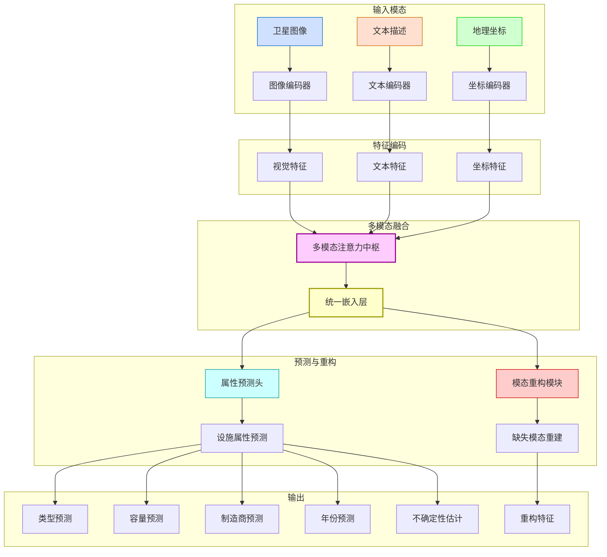

# 可再生能源设施多模态模型

本模块实现了一个先进的多模态模型，用于可再生能源设施的属性推断。该模型能够整合卫星图像、文本描述和地理坐标信息，以预测设施的类型、容量等属性，并提供不确定性估计。

## 模型架构



模型由以下主要组件构成：

### 1. 专业化编码器

每个输入模态都有专门设计的编码器，以提取最相关的特征：

- **卫星图像编码器** (`SatelliteImageEncoder`)
  - 多尺度特征提取，捕获不同粒度的视觉信息
  - 位置敏感注意力机制，保留空间关系
  - 残差连接和层标准化，提高训练稳定性
  - 支持多种输入格式（张量、文件路径、NumPy数组、PIL图像）

- **文本描述编码器** (`TextEncoder`)
  - 术语注意力机制，增强对能源领域专业术语的理解
  - 分层特征提取，捕获不同级别的语义信息
  - 自注意力机制，处理长距离依赖关系
  - 支持多种输入格式（字符串、字符串列表、已分词的ID张量）

- **地理坐标编码器** (`GeoCoordEncoder`)
  - WGS84→ECEF坐标转换，提供全球一致的表示
  - 精度控制机制，适应不同精度级别的坐标输入
  - 分层位置编码，捕获不同地理粒度的位置信息
  - 支持多种输入格式（字典、张量、坐标元组列表）

### 2. 多模态注意力中枢

- **增强型跨模态注意力**
  - 实现不同模态之间的信息交互和融合
  - 自适应注意力门控，控制信息流动
  - 多头注意力机制，从不同角度捕获模态间关系

- **模态对交互**
  - 视觉-文本交互：将视觉特征与文本描述对齐
  - 视觉-坐标交互：将视觉特征与地理位置关联
  - 文本-坐标交互：将文本描述与地理位置关联

### 3. 统一嵌入层

- **多模态特征整合**
  - 将不同模态的特征映射到共享语义空间
  - Transformer编码器处理模态间的复杂关系
  - 模态标识符嵌入，区分不同模态组合

- **模态组合适应**
  - 自动适应不同的模态组合（7种可能的组合）
  - 处理缺失模态的情况，保持表示一致性

### 4. 属性预测头

- **多任务预测**
  - 设施类型预测（风能/光伏）
  - 容量预测（MW）
  - 制造商预测
  - 建成年份预测
  - 设备型号预测

- **不确定性估计**
  - 为每个预测提供置信度评分
  - 支持风险感知决策
  - 识别需要人工审核的案例

- **领域知识约束**
  - 应用可再生能源领域的先验知识
  - 确保预测结果符合物理和工程约束
  - 风机型号与容量范围的关系
  - 光伏设施的典型容量范围

### 5. 模态重构模块

- **缺失模态重建**
  - 从可用模态重构缺失模态的特征表示
  - 提高模型对不完整输入的鲁棒性
  - 为每个重构提供置信度评分

- **专用解码器**
  - 视觉重构网络
  - 文本重构网络
  - 坐标重构网络

## 核心功能与增强特性

### 1. 高级多模态融合

- **跨模态注意力**
  - 自适应注意力权重，根据输入内容动态调整模态重要性
  - 多头注意力机制，从不同角度捕获模态间关系
  - 位置敏感注意力，保留空间和序列关系

- **层次化融合**
  - 低级特征融合：捕获基本的模态对齐
  - 中级特征融合：整合语义和空间关系
  - 高级特征融合：形成统一的多模态表示

- **自适应融合策略**
  - 根据输入质量动态调整融合权重
  - 对噪声或低质量输入降低权重
  - 对高信息量输入增加权重

### 2. 智能缺失模态处理

- **模态存在指示器**
  - 为每个模态维护存在指示器
  - 在缺失模态时提供默认表示
  - 确保模型架构一致性

- **优雅降级机制**
  - 根据可用模态自动调整预测策略
  - 维持预测性能的平滑降级
  - 提供降级预测的不确定性估计

- **模态重构**
  - 从可用模态重建缺失模态
  - 提供重建质量的置信度评分
  - 支持多种重建策略（最大似然、对抗性）

### 3. 全面的不确定性估计

- **多层次不确定性**
  - 数据不确定性：捕获输入数据的噪声和变异
  - 模型不确定性：反映模型参数的不确定性
  - 预测不确定性：综合评估预测的可靠性

- **校准的置信度**
  - 使用温度缩放等技术校准置信度
  - 确保置信度分数与实际准确率一致
  - 支持可靠的决策制定

- **不确定性可视化**
  - 提供不确定性的直观可视化
  - 支持风险感知决策
  - 识别需要人工审核的案例

### 4. 超灵活的输入处理

- **多格式输入支持**
  - **图像**：张量、文件路径、NumPy数组、PIL图像、URL
  - **文本**：字符串、字符串列表、已分词的ID张量、嵌入向量
  - **坐标**：字典、张量、坐标元组列表、GeoJSON

- **自动格式检测与转换**
  - 智能识别输入格式
  - 自动转换为模型所需格式
  - 详细的错误消息和异常处理

- **批处理优化**
  - 高效的批处理实现
  - 动态批大小调整
  - 内存优化的数据处理

### 5. 领域特定优化

- **可再生能源领域知识**
  - 风机型号与容量关系的先验知识
  - 光伏设施的典型特征模式
  - 地理位置与设施类型的关联

- **约束预测**
  - 应用物理和工程约束
  - 确保预测结果的一致性
  - 提高极端情况下的预测质量

## 优秀设计亮点

### 1. 模块化架构

- **组件化设计**
  - 每个功能模块独立封装
  - 清晰定义的接口和责任
  - 支持单元测试和独立开发

- **分层结构**
  - 数据层：处理输入和输出
  - 编码层：特征提取和表示
  - 融合层：多模态信息整合
  - 预测层：属性推断和不确定性估计

- **可扩展性**
  - 易于添加新的编码器
  - 支持新的融合策略
  - 可扩展的预测任务

### 2. 配置驱动的初始化

- **灵活配置系统**
  - 支持YAML和JSON格式
  - 层次化配置结构
  - 合理的默认值

- **配置验证**
  - 自动检查配置有效性
  - 详细的错误消息
  - 配置迁移支持

- **运行时配置**
  - 支持热重载配置
  - 实验跟踪和版本控制
  - 配置继承和覆盖

### 3. 高级特征提取

- **图像特征提取**
  - 多尺度特征融合
  - 位置敏感注意力
  - 残差连接和层标准化

- **文本特征提取**
  - 术语注意力机制
  - 分层特征提取
  - 领域适应的文本表示

- **坐标特征提取**
  - 分层位置编码
  - 精度控制机制
  - 地理空间关系建模

### 4. 健壮的错误处理

- **全面的输入验证**
  - 类型检查和格式验证
  - 值范围验证
  - 缺失值处理

- **优雅的异常处理**
  - 详细的错误消息
  - 分层的异常类型
  - 回退机制

- **全面的日志记录**
  - 结构化日志
  - 可配置的日志级别
  - 性能监控和调试信息

### 5. 高效的保存和加载机制

- **完整状态保存**
  - 模型参数
  - 配置信息
  - 训练状态

- **版本兼容性**
  - 向后兼容的加载机制
  - 版本迁移支持
  - 模型升级路径

- **设备适配**
  - 跨设备加载支持
  - CPU/GPU自动适配
  - 分布式训练支持

## 使用示例

### 基本用法

```python
from renewable_facility.modeling.enhanced_model import EnhancedMultiModalModel

# 创建模型
model = EnhancedMultiModalModel()

# 准备输入
img = torch.randn(2, 3, 256, 256)  # 批量图像
text = ["This is a renewable energy facility", "Another facility description"]  # 批量文本
coords = torch.tensor([[120.0, 30.0], [110.0, 40.0]])  # 批量坐标

# 运行模型
outputs = model(
    imagery_features=img,
    text_features=text,
    coord_features=coords
)

# 获取预测结果
predictions = outputs['attribute_predictions']
print(f"预测类型: {torch.argmax(predictions['type'], dim=1)}")  # 0=风能, 1=光伏
print(f"预测容量: {predictions['capacity'].squeeze()} MW")
print(f"容量不确定性: ±{predictions['capacity_uncertainty'].squeeze()} MW")
print(f"预测年份: {2000 + predictions['year'].squeeze().int()}")
```

### 使用配置文件

```python
from renewable_facility.modeling.enhanced_model import EnhancedMultiModalModel
from renewable_facility.modeling.config import load_config

# 加载配置
config = load_config('renewable_facility/modeling/config/default_config.yaml')

# 自定义配置
config['model']['common_embedding_dim'] = 512
config['encoders']['imagery']['multiscale_fusion'] = True
config['encoders']['text']['pooling_strategy'] = 'term_attention'
config['encoders']['coordinate']['precision_mode'] = 'precise'

# 创建模型
model = EnhancedMultiModalModel(config_path='renewable_facility/modeling/config/default_config.yaml')
# 或者直接传递配置字典
# model = EnhancedMultiModalModel(**config['model'])

# 保存模型
model.save('models/my_model.pt')

# 加载模型
loaded_model = EnhancedMultiModalModel.load('models/my_model.pt')
```

### 处理缺失模态

```python
# 只有图像和坐标
outputs_no_text = model(
    imagery_features=img,
    coord_features=coords
)

# 只有文本
outputs_only_text = model(
    text_features=text
)

# 检查模型如何适应不同的模态组合
print(f"完整模态预测置信度: {outputs['attribute_predictions']['type_uncertainty']}")
print(f"缺失文本预测置信度: {outputs_no_text['attribute_predictions']['type_uncertainty']}")
print(f"仅文本预测置信度: {outputs_only_text['attribute_predictions']['type_uncertainty']}")
```

### 模态重构

```python
# 从文本和坐标重构图像特征
reconstructed_img_features, confidence = model.reconstruct_modality(
    target_modality=0,  # 0=视觉, 1=文本, 2=坐标
    text_features=text,
    coord_features=coords
)

print(f"重构置信度: {confidence}")

# 从图像重构文本特征
reconstructed_text_features, confidence = model.reconstruct_modality(
    target_modality=1,  # 0=视觉, 1=文本, 2=坐标
    imagery_features=img
)

# 使用重构特征进行预测
outputs_with_reconstructed = model(
    imagery_features=img,
    text_features=reconstructed_text_features
)
```

### 获取嵌入向量

```python
# 获取统一嵌入向量
embeddings = model.get_embeddings(
    imagery_features=img,
    text_features=text,
    coord_features=coords
)

# 用于下游任务
from sklearn.neighbors import NearestNeighbors

# 创建最近邻索引
nn = NearestNeighbors(n_neighbors=5)
nn.fit(embeddings.detach().cpu().numpy())

# 查询相似设施
query_embedding = model.get_embeddings(text_features="大型风电场")
distances, indices = nn.kneighbors(query_embedding.detach().cpu().numpy())

print(f"最相似的设施索引: {indices}")
print(f"相似度距离: {distances}")
```

### 高级可视化

```python
from renewable_facility.modeling.visualization import VisualizationManager

# 创建可视化管理器
visualizer = VisualizationManager(output_dir='visualizations')

# 可视化注意力权重
attention_weights = outputs['attention_weights']
visualizer.plot_attention_weights(
    attention_weights,
    modality_names=['图像', '文本', '坐标'],
    save_path='attention_map.png'
)

# 可视化嵌入空间
visualizer.plot_embeddings(
    embeddings.detach().cpu().numpy(),
    labels=torch.argmax(predictions['type'], dim=1).cpu().numpy(),
    method='tsne',
    save_path='embeddings.png'
)

# 可视化不确定性
visualizer.plot_uncertainty(
    predictions['capacity'].detach().cpu().numpy(),
    predictions['capacity_uncertainty'].detach().cpu().numpy(),
    save_path='uncertainty.png'
)
```

## 目录结构

```
renewable_facility/modeling/
├── README.md                    # 本文档
├── __init__.py                  # 模块初始化
├── enhanced_model.py            # 增强型多模态模型
├── inference.py                 # 推理引擎
├── evaluator.py                 # 评估工具
├── data_loader.py               # 数据加载器
├── test_model.py                # 测试脚本
├── visualization.py             # 可视化工具
├── run_inference_server.py      # 推理服务器启动脚本
├── config/                      # 配置相关
│   ├── __init__.py              # 配置模块初始化
│   ├── config_loader.py         # 配置加载和保存
│   └── default_config.yaml      # 默认配置文件
├── components/                  # 模型组件
│   ├── __init__.py              # 组件模块初始化
│   ├── embedding.py             # 统一嵌入层
│   ├── prediction_heads.py      # 属性预测头
│   ├── reconstruction.py        # 模态重构模块
│   ├── losses.py                # 多任务损失函数
│   ├── uncertainty.py           # 不确定性估计
│   ├── fusion.py                # 融合策略
│   └── attention.py             # 注意力机制实现
└── enhanced_encoders/           # 增强型编码器
    ├── __init__.py              # 编码器模块初始化
    ├── geo_encoder.py           # 地理坐标编码器
    ├── image_encoder.py         # 图像编码器
    └── text_encoder.py          # 文本编码器
```

## 性能优化

### 批处理优化

- **动态批处理**：根据输入大小自动调整批大小
- **梯度累积**：支持大批量训练而不消耗过多内存
- **预取和缓存**：减少数据加载瓶颈

### 计算优化

- **混合精度训练**：使用FP16加速训练
- **模型量化**：支持INT8推理
- **图优化**：使用TorchScript优化计算图

### 内存优化

- **梯度检查点**：减少大模型的内存占用
- **特征重用**：避免重复计算
- **智能缓存**：缓存频繁使用的中间结果

### 设备管理

- **自动设备检测**：自动选择最佳可用设备
- **多GPU支持**：支持数据并行训练
- **CPU回退**：在GPU不可用时优雅降级到CPU

## 高性能推理

本模块提供了高性能推理引擎，支持多种优化技术和部署选项。

### 推理优化

- **模型量化**：支持INT8量化，减少内存占用和提高推理速度
- **ONNX导出**：支持导出为ONNX格式，使用ONNX Runtime进行高效推理
- **TorchScript**：支持TorchScript优化，提高推理性能
- **混合精度**：支持FP16混合精度推理，在保持精度的同时提高速度
- **批处理优化**：支持动态批处理大小调整，根据输入和可用资源优化性能
- **预测缓存**：缓存常见输入的预测结果，减少重复计算
- **并行处理**：支持多线程并行处理批量请求

### API服务器

模块包含内置的API服务器，提供RESTful接口进行模型推理：

```bash
# 启动API服务器
python -m renewable_facility.modeling.run_inference_server --model_path models/best_model.pt --port 8000
```

API服务器提供以下端点：

- **POST /predict**：单个预测请求，支持图像、文本和坐标输入
- **POST /batch_predict**：批量预测请求，支持多个样本的并行处理
- **POST /predict_base64**：支持Base64编码图像的预测请求
- **GET /health**：健康检查和性能指标监控

### 推理服务器配置

推理服务器支持多种配置选项：

```bash
# 使用ONNX优化和FP16精度
python -m renewable_facility.modeling.run_inference_server \
    --model_path models/best_model.pt \
    --optimization onnx \
    --precision fp16 \
    --batch_size 64 \
    --workers 8

# 使用量化优化（适用于CPU部署）
python -m renewable_facility.modeling.run_inference_server \
    --model_path models/best_model.pt \
    --device cpu \
    --optimization quantized \
    --precision int8
```

### 性能监控

API服务器提供实时性能指标监控：

- **平均推理时间**：每个请求的平均处理时间
- **缓存命中率**：预测缓存的命中率
- **批处理统计**：平均批处理大小和处理速度
- **资源利用率**：CPU/GPU利用率和内存使用情况

## 未来工作

- **多语言支持**：添加多语言文本编码器
- **时序数据整合**：支持时间序列数据作为额外模态
- **更多预训练模型**：集成更多预训练视觉和语言模型
- **主动学习**：实现不确定性驱动的主动学习策略
- **联邦学习**：支持隐私保护的分布式训练
- **模型压缩**：实现知识蒸馏和模型剪枝
- **可解释性**：增强模型决策的可解释性
- **自适应学习**：实现在线学习和域适应

## 模型训练

本节介绍如何训练可再生能源设施多模态模型，包括单机单卡、单机多卡和多机多卡的分布式训练方法。

### 训练脚本

我们提供了一个灵活的训练脚本 `run_train.sh`，支持多种训练场景和配置选项。该脚本使用 PyTorch 的 `torchrun` 工具（PyTorch 1.10+ 推荐的分布式训练启动器）来管理分布式训练进程：

```bash
# 使脚本可执行
chmod +x run_train.sh

# 查看帮助信息
./run_train.sh --help
```

### 单GPU训练

最简单的训练方式是使用单个GPU：

```bash
# 使用默认参数进行单GPU训练
./run_train.sh

# 自定义训练参数
./run_train.sh --batch_size 64 --lr 0.0002 --epochs 100 --config config/custom_config.yaml
```

### 单机多GPU训练

对于单机多GPU训练，只需指定GPU数量：

```bash
# 使用4个GPU进行训练
./run_train.sh --gpus 4 --batch_size 32

# 每个GPU的批次大小为32，实际总批次大小为32*4=128
```

### 多机多GPU训练

对于大规模训练，支持多机多GPU配置：

```bash
# 在主节点（rank 0）上运行
./run_train.sh --gpus 8 --nodes 2 --node_rank 0 --port 29500

# 在从节点（rank 1）上运行
./run_train.sh --gpus 8 --nodes 2 --node_rank 1 --port 29500
```

### 混合精度训练

默认启用混合精度训练以加速训练过程：

```bash
# 启用混合精度训练（默认）
./run_train.sh --gpus 4

# 禁用混合精度训练
./run_train.sh --gpus 4 --no_amp
```

### 训练配置

训练脚本支持以下主要参数：

| 参数 | 说明 | 默认值 |
|------|------|--------|
| `--gpus` | 使用的GPU数量 | 1 |
| `--batch_size` | 每个GPU的批次大小 | 32 |
| `--lr` | 学习率 | 0.0001 |
| `--epochs` | 训练轮次 | 50 |
| `--config` | 配置文件路径 | config/default_config.yaml |
| `--output` | 输出目录 | outputs/日期_时间 |
| `--data` | 数据路径 | data/processed |
| `--no_amp` | 禁用混合精度训练 | (默认启用) |
| `--save_every` | 每N个epoch保存一次检查点 | 5 |
| `--port` | 主端口，用于分布式训练 | 29500 |
| `--nodes` | 节点数量，用于多机训练 | 1 |
| `--node_rank` | 节点排名，用于多机训练 | 0 |

### 训练监控

训练过程中会生成以下日志和输出：

1. **训练配置日志**：记录所有训练参数和环境信息
2. **训练日志**：记录每个epoch的损失、指标和学习率
3. **检查点**：定期保存模型检查点
4. **可视化**：如果启用，生成注意力权重、嵌入空间等可视化

### 恢复训练

可以从之前的检查点恢复训练：

```bash
# 从检查点恢复训练
./run_train.sh --gpus 4 --resume outputs/20250507_123456/checkpoints/checkpoint_epoch_25.pt
```

### 训练后评估

训练完成后，可以使用以下命令评估模型：

```bash
# 在测试集上评估模型
python -m renewable_facility.modeling.run_evaluate --model_path outputs/20250507_123456/checkpoints/best_model.pt --data_path data/test --visualize
```

评估命令支持以下参数：

- `--model_path`: 训练好的模型路径（必需）
- `--data_path`: 测试数据集路径（必需）
- `--output_dir`: 评估结果保存目录（默认：evaluation_results）
- `--batch_size`: 评估批次大小（默认：32）
- `--device`: 计算设备（默认：cuda 或 cpu）
- `--visualize`: 生成可视化结果（可选标志）
- `--config_path`: 模型配置文件路径（可选）

评估结果将包括：
1. 详细的分类和回归指标
2. 混淆矩阵和错误分布可视化
3. 注意力权重和嵌入空间可视化
4. 交互式HTML报告
5. JSON格式的完整指标