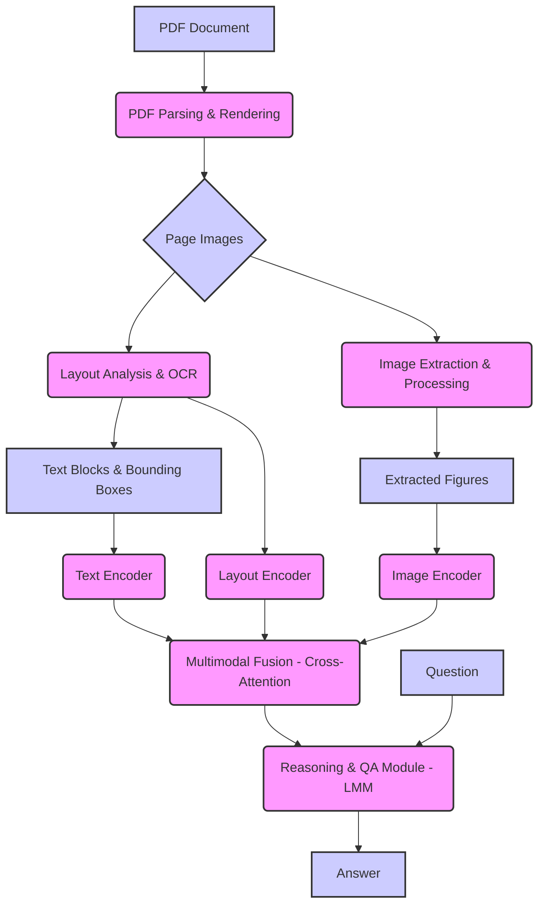

# 工业技术文档多模态推理问答技术方案

## 任务描述回顾

本次工业技术文档多模态推理问答评测任务面临三大挑战：
1.  **图片型原始文档识别：** 不可编辑的 PDF 文档难以准确识别数据，分辨率低，格式多样，内容复杂。
2.  **多模态信息融合需求：** 问题解答常需同时解析文本描述和技术图纸的多模态数据。
3.  **复杂化领域知识推理：** 答案常需通过图纸结构解析、模块功能理解或机械原理推导获得。

评测数据为 JSONL 格式的样例集和评测集，以及原始 PDF 文档集，来源于国内发明专利开放数据。

## 提出的技术方案架构

为了应对本次任务的挑战，需要一个强大的多模态架构。核心思想是构建一个能够摄取 PDF 文档、提取和处理文本及视觉信息、有效地融合这些模态，然后使用强大的模型进行推理和问答的流水线。

### 关键组件

1.  **文档预处理模块 (Document Preprocessing Module):**
    *   **PDF 解析与渲染 (PDF Parsing and Rendering):** 解析 PDF 并将每一页渲染成高分辨率图像。
    *   **版面分析 (Layout Analysis):** 分析每一页图像的版面，识别不同的区域，如文本块、标题、图表、表格等，理解空间关系。
    *   **光学字符识别 (OCR):** 对识别出的文本区域应用 OCR 以提取可编辑文本，需处理技术术语和复杂字体。
    *   **图像提取与处理 (Image Extraction and Processing):** 提取技术图纸和图表，可能应用图像增强技术。
    *   **图表内容分析 (Figure Content Analysis) (可选但推荐):** 对技术图纸进行进一步分析，如目标检测，以理解结构和功能。

2.  **多模态编码模块 (Multimodal Encoding Module):**
    *   **文本编码器 (Text Encoder):** 使用强大的预训练语言模型为提取的文本块生成上下文相关的嵌入。
    *   **图像编码器 (Image Encoder):** 使用强大的预训练视觉模型为处理后的页面图像或提取的图表生成嵌入。
    *   **版面编码器 (Layout Encoder):** 对从版面分析中获得的空间和结构信息进行编码。

3.  **多模态融合模块 (Multimodal Fusion Module):**
    *   使用**基于 Transformer 的交叉注意力机制 (Transformer-based cross-attention mechanisms)** 融合文本、图像和版面特征，实现对文档内容的整体理解，捕捉文本描述与图纸中相应部分之间的关系。

4.  **推理与问答模块 (Reasoning and Question Answering Module):**
    *   核心是一个大型多模态模型 (LMM)，接收融合后的多模态表示和问题作为输入。
    *   LMM 需具备复杂的推理能力，包括文本推理、视觉推理、跨模态推理和领域特定推理。
    *   输出是按照任务要求格式化的答案。

### 架构图

### 实现注意事项

*   **基础多模态模型 (Base Multimodal Model):** 利用强大的预训练视觉-语言模型 (VLM) 作为基础，如 Google 的 Gemini, OpenAI 的 GPT-4V, LLaVA, Fuyu 等。
*   **微调 (Fine-tuning):** 在提供的 JSONL 数据和相应的 PDF 文档上对选定的 LMM 进行微调，以适应特定领域和任务格式。
*   **处理低分辨率 (Handling Low Resolution):** 研究超分辨率技术或使用专门训练的模型处理低分辨率图像。
*   **领域知识 (Domain Knowledge):** 探索注入或利用外部领域知识（如知识图谱）来增强模型在复杂技术概念和机械原理推理方面的能力。